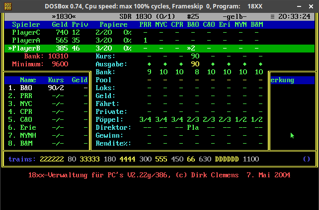

# Lemmi's 18xx/PC Moderator — Deep Analysis

*Reference document for 18xxBroker UI/UX improvements. This is the gold standard of 18xx table software — 20+ years in use, still preferred by many experienced players.*

## Why Lemmi Endures

Created by Dirk Clemens around 1995-2004 (last version V2.22g, May 2018). A DOS text-mode program. Still actively used at conventions and game tables via DOSBox emulation in 2026. That's 30 years.

**Why it survives:**
1. **Everything on one screen** — no tabs, no navigation, no scrolling. Glance and you know the full game state.
2. **Speed** — mouse click to buy, right-click to bid, middle-click to pass. No modals, no confirmation dialogs. Expert players don't want friction.
3. **Density** — the DOS text grid wastes zero pixels. Every character conveys information.
4. **Correctness** — decades of edge-case refinement. Players trust it completely.
5. **Minimal physical components** — only need the map board, tiles, and station tokens. Everything else is on screen.

The lesson: **information density and speed beat aesthetics** for serious players.

---

## The Main Screen — Anatomy



### Layout (from the actual screenshot)

The screen is divided into three horizontal bands:

#### Top Band: Player State (yellow/green on blue)

```
»1830«         SDR 1830 (0/1)  #25    -gelb-    20:33:24
Spieler  Geld Priv Papiere  PRR NYC CPR B&O C&O Eri NYN B&M
PlayerC  740  12   2/20  0%
PlayerA  565  35   3/20  0%    1    -
»PlayerB 385  46   3/20  0%         »2         -  90
```

**What each column is:**
- `Spieler` = Player name. `»` = priority deal holder
- `Geld` = Cash on hand
- `Priv` = Value of private companies owned
- `Papiere` = Certificates held / cert limit
- `%` = Total share percentage held (all corps)
- Then **one column per corporation**: number = shares owned, `»` = president

**Key insight:** Player cash, cert count, and ALL shareholdings visible in a single row. No need to open any detail view.

#### Middle Band: Corporation State (green/cyan)

```
Bank: 10310    Kurs:        -   -  90   -   -   -   -   -
Minimum: 9600  Ausgabe:     ♦   -  90   -   -   -   -   -

               Bank:        9  10  10   8  10  10  10  10
Name  Kurs Geld Pool:       -   -   -   -   -   -   -   -
1. B&O 90/2  -  Loks:       -   -   -   -   -   -   -   -
2. PRR  -/-  -  Geld:       -   -   -   -   -   -   -   -
3. NYC  -/-  -  Fährt:      -   -   -   -   -   -   -   -
4. CPR  -/-  -  Private:    -   -   -   -   -   -   -   -
5. C&O  -/-  -  Pöppel:  3/4 3/4 3/4 2/3 2/3 2/3 1/2 1/2
6. Erie -/-  -  Direktor:       Pla  -   -   -   -   -   -
7. NYNH -/-  -  Gewinn:     -   -   -   -   -   -   -   -
8. B&M  -/-  -  Rendite:    -   -   -   -   -   -   -   -
```

**Row meanings (German → English):**
- `Kurs` = Current share price / market row (e.g., "90/2" = price 90 in row 2)
- `Geld` = Corp treasury
- `Bank` = IPO shares remaining
- `Pool` = Market pool shares
- `Loks` = Trains owned (compact: "233" = one 2-train, two 3-trains)
- `Fährt` = Revenue amount (+ = pay, - = withhold, toggle with right-click)
- `Private` = Private companies owned by corp
- `Pöppel` = Station tokens (placed/total, e.g., "2/3")
- `Direktor` = President (player name)
- `Gewinn` = Profit/income
- `Rendite` = Yield/return
- `Ausgabe` = Par/issue price

**Key insight:** The left column lists corps with their Kurs (price+position), and the right side is a **matrix** — each column is a corp, each row is a data type. You read down a column to see everything about one corp, or across a row to compare all corps on one metric.

#### Bottom Band: Train Depot (white on blue)

```
trains: 222222 80 33333 180 4444 300 555 450 66 630 DDDDDD 1100    ()
```

**Format:** Each character represents one physical train. "222222" = six 2-trains available. Price follows each group. Brilliant compact encoding — you instantly see how many of each type remain and what they cost.

**Key insight:** This single line tells you everything about phase pressure. You can count remaining trains at a glance.

---

## What Makes This UI Work

### 1. The Matrix Layout

Corps as columns, data types as rows. This is the killer feature. Lemmi's layout answers these questions instantly:

- "Who has the most trains?" → scan the `Loks` row
- "Which corps are trainless?" → empty cells in `Loks`
- "How much cash does each corp have?" → scan `Geld` row
- "Who owns what?" → scan player rows across corp columns
- "What's the cheapest station?" → scan `Pöppel` row

**18xxBroker lesson:** We show corps one at a time (tab + swipe). Lemmi shows ALL corps simultaneously. A dense overview/comparison screen would be valuable.

### 2. The Train Line

One line, entire depot. No expanding panels, no scrolling. The character-per-train encoding is genius — "33333" means five 3-trains. You count characters. The price sits right next to the group.

**18xxBroker lesson:** Our depot is a list of buttons in the corps tab. A compact summary like Lemmi's would help players assess phase timing without navigating to a specific corp.

### 3. The Kurs Column

"90/2" = price 90 in row 2. This eliminates needing a separate stock market view for most purposes. Players only care about the market board to compare relative positions, but for individual corp tracking, this inline notation is sufficient.

**18xxBroker lesson:** We show stock price in the corp detail view but not in any overview. Adding price to the corp selector tabs would help.

### 4. President Marking

`»` before a player name means priority deal. `»` before a share count means president. Same character, context-dependent. Minimal but unambiguous.

### 5. Revenue Toggle

Right-click on the `Fährt` (revenue) field toggles between + (pay) and - (withhold). No separate buttons, no modal. The sign change IS the action.

**18xxBroker lesson:** Our three big buttons (Pay/Half/Withhold) are clearer for new players but slower for experts. Consider keyboard shortcuts.

---

## Information Density Comparison

| Data Point | Lemmi | 18xxBroker |
|---|---|---|
| All player cash | One glance (top rows) | Switch between player tabs |
| All corp treasuries | One glance (Geld row) | Swipe through corps tab |
| All corp trains | One glance (Loks row) | Swipe through corps tab |
| All share prices | One glance (Kurs column) | Market tab grid |
| Who owns what | One glance (player × corp matrix) | Market tab player selector |
| Train depot | One line (bottom) | Inside corp detail panel |
| Phase info | Implicit from train depot | Header badge |
| Cert count/limit | Per player row | Player selector bar |

**Lemmi answers: ~12 seconds to scan entire game state.**
**18xxBroker: ~30-60 seconds navigating tabs.**

---

## What Lemmi Gets Wrong (or doesn't attempt)

1. **No guidance** — you must know whose turn it is. No prompts, no suggestions.
2. **No analysis** — no "should you pay or withhold?" No train rush warnings.
3. **No what-if** — commit or undo. Can't explore branches.
4. **No sync** — one screen, one computer. Passed around the table or projected.
5. **No import** — manual entry only.
6. **Cryptic** — German labels, DOS aesthetics, steep learning curve. The matrix is powerful once learned but hostile to newcomers.
7. **Single view** — the stock market view exists but is hard to read. No detailed corp or player views.

---

## Design Principles to Steal

### For 18xxBroker's next iteration:

1. **Add a "Lemmi view" / Overview screen** — single-screen matrix showing all players × all corps. Cramped on mobile but perfect for tablet landscape or projector mode.

2. **Compact train depot strip** — always-visible bar showing remaining trains per type with count. Not hidden inside corp details.

3. **Inline price in corp selectors** — the corp tab selector buttons should show current price, not just sym/color.

4. **Keyboard shortcuts for power users** — P for pay, W for withhold, H for half, N for next corp, number keys for revenue presets.

5. **President indicators everywhere** — Lemmi's `»` is great. We should mark presidents more prominently in all views.

6. **Comparison mode** — ability to see all corps side-by-side on one metric (cash, trains, price, shares outstanding).

---

## Download Lemmi

The DOS moderator can be downloaded from: **https://18xx.de/download.html**

- V2.22g base package (549 KB) — requires DOSBox to run
- V2.22g extension (739 KB) — additional game definitions
- HTML documentation (730 KB)

The download requires a browser (direct curl is blocked by the server).

---

## Other Moderators for Reference

| Program | Platform | Status | Notes |
|---|---|---|---|
| **Lemmi 18xx/PC** | DOS (DOSBox) | V2.22g (2018) | The classic. Still used. |
| **Graphite** | Java 8 | Active | Modern Lemmi replacement. [YouTube demo](https://www.youtube.com/watch?v=jzvLubBc7yU) |
| **Rails** | Java | Active | Full game engine, not just moderator. [SourceForge](https://sourceforge.net/projects/rails/) |
| **18xx.games** | Web (Ruby) | Active | Full online play. [18xx.games](https://18xx.games) |
| **XeryusTC/18xx-moderator** | Web | Archived | Web-based moderator attempt. [GitLab](https://gitlab.com/XeryusTC/18xx-moderator) |

---

## Sources

- [1830 with Lemmi's moderator (1/3) — Rails on Boards](https://www.railsonboards.com/2019/01/14/1830-with-lemmis-moderator-1-3/)
- [1830 with Lemmi's moderator (3/3) — Rails on Boards](https://www.railsonboards.com/2019/01/17/1830-with-lemmis-moderator-3-3/)
- [18xx.de — Dirk Clemens' homepage](https://18xx.de/)
- [Graphite moderator demo — YouTube](https://www.youtube.com/watch?v=jzvLubBc7yU)
- [18XX games supported by Graphite — BGG](https://boardgamegeek.com/geeklist/231253/18xx-games-supported-graphite-moderator)
- [18xx tools — Westpark Gamers](https://www.westpark-gamers.de/en/18xxtools.html)
